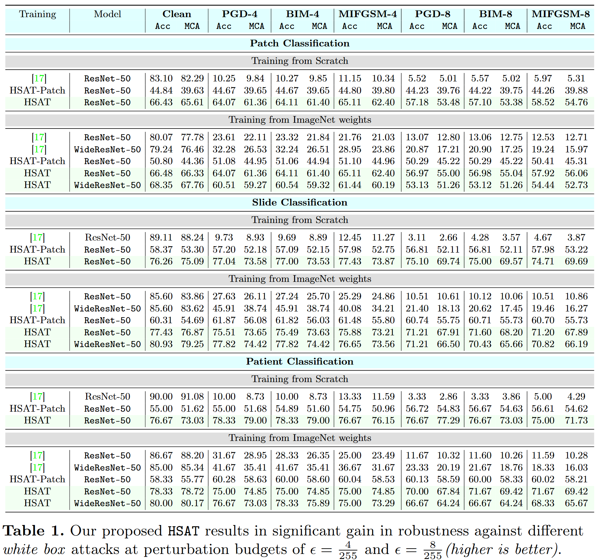
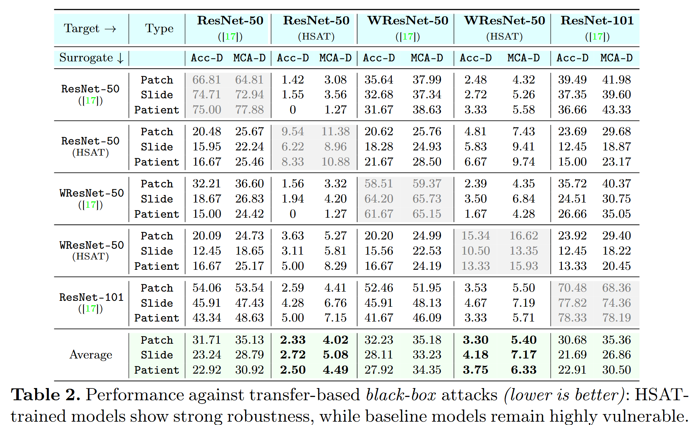
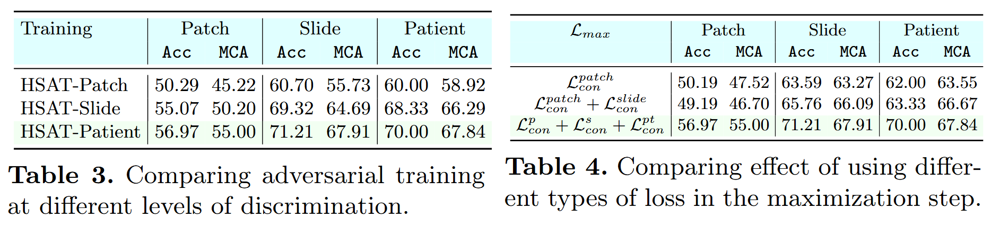

# **HSAT: Hierarchical Self-Supervised Adversarial Training for Robust Vision Models in Histopathology**

[Hashmat Shadab Malik](https://github.com/HashmatShadab),
[Shahina Kunhimon](https://github.com/ShahinaKK),
[Muzammal Naseer](https://scholar.google.ch/citations?user=tM9xKA8AAAAJ&hl=en),
[Fahad Shahbaz Khan](https://scholar.google.es/citations?user=zvaeYnUAAAAJ&hl=en),
and [Salman Khan](https://salman-h-khan.github.io)

#### **Mohamed Bin Zayed University of Artificial Intelligence, Khalifa University, Linko ̈ping University, and Australian National University**

[](https://arxiv.org/abs/2503.10629)
[](https://hashmatshadab.github.io/HSAT/)


[//]: # ([![Video]&#40;https://img.shields.io/badge/Video-Presentation-F9D371&#41;]&#40;https://drive.google.com/file/d/1ZdUV83RvyL4mqCyxlqqD468VbRRAGdDY/view?usp=sharing&#41;)

[//]: # ([![slides]&#40;https://img.shields.io/badge/Poster-PDF-87CEEB&#41;]&#40;https://drive.google.com/file/d/1fvR4KUFCAEFO7wZqr-f8isk5FYMQvsT9/view?usp=sharing&#41;)

[//]: # ([![slides]&#40;https://img.shields.io/badge/Presentation-Slides-B762C1&#41;]&#40;https://drive.google.com/file/d/1osaG-OsgUlODRfRqDPK6f79bOLmRcC42/view?usp=sharing&#41;)


Official PyTorch implementation

<hr />

# :fire: News

* **(June 3, 2025)**
    * We've released model weights for baseline and HSAT training. Check them out in the [Pre-trained Model Weights](#Pre-trained-Model-Weights) section.
* **(March 14, 2025)**
    * HSAT paper is released on [arxiv](https://arxiv.org/abs/2503.10629).
* **(March 13, 2025)**
    * We open source the code for model training and evaluation.

<hr />


> **<p align="justify"> Abstract:** *Adversarial attacks pose significant challenges for vision models in critical
fields like healthcare,
> where
> reliability is essential.
> Although adversarial training has been well studied in natural images, its application to biomedical and microscopy
> data remains limited.
> Existing self-supervised adversarial training methods overlook the hierarchical structure of histopathology images,
> where patient-slide-patch
> relationships provide valuable discriminative signals. To address this, we propose Hierarchical Self-Supervised
> Adversarial Training (HSAT),
> which exploits these properties to craft adversarial examples using multi-level contrastive learning and integrate it
> into adversarial training for enhanced robustness.
> We evaluate HSAT on multiclass histopathology cancer diagnosis
> dataset OpenSRH and the results show that HSAT outperforms existing methods from both biomedical and natural
> image domains. HSAT enhances robustness, achieving an average gain of 54.31% in the white-box setting and
> reducing performance drops to 3-4% in the black-box setting, compared to 25-30% for the baseline. These results set a
> new benchmark for adversarial training in this domain, paving the way for more robust models. Our code and pretrained
> models will be made publicly available.* </p>

<hr />

<div align="center">
    

<p align="justify">
We propose <tt>HSAT</tt>, a <b>min-max optimization framework</b> to learn <i>robust representations</i> via self-supervised contrastive learning. The inner maximization step, <b>𝓛<sub>max</sub></b>, generates adversarial perturbations by crafting a <i>hierarchy-wise attack</i>. The outer minimization step, <b>𝓛<sub>min</sub></b>, updates the encoder <b>f<sub>θ</sub></b> to minimize the hierarchical contrastive loss, encouraging <b>robust feature representations</b> across <i>patch</i>, <i>slide</i>, and <i>patient</i> levels.
</p>

</div>

<hr />

## Contents

1) [Installation](#Installation)
2) [Models and Data Preparation](#Models-and-Data-Preparation)
3) [Pre-trained Model Weights](#Pre-trained-Model-Weights)
4) [Training](#Training)
5) [Robustness against White-Box Attacks](#Robustness-against-White-Box-Attacks)
6) [Robustness against Transfer-Based Black-Box Attacks](#Robustness-against-Transfer-Based-Black-Box-Attacks)
7) [BibTeX](#bibtex)
8) [Contact](#contact)
9) [References](#references)

<hr>
<hr>


<a name="Installation"/>

## 💿 Installation

```python
conda create -n hsat
conda activate hsat
conda install pytorch==2.1.2 torchvision==0.16.2 torchaudio==2.1.2 pytorch-cuda=11.8 -c pytorch -c nvidia
pip install timm
pip install wandb
pip install tifffile
pip install dill
pip install hydra-core --upgrade
pip install matplotlib
pip install scikit-learn
pip install tqdm
pip install torchmetrics
pip install pandas
pip install opencv-python
pip install gdown
pip install ftfy regex tqdm
pip install transformers

```

<a name="Models-and-Data-Preparation"/>

## 🛠️ Models and Data Preparation

### 📦 Available Models

| Model                                        | Identifier                 |
|----------------------------------------------|----------------------------|
| ResNet-50 (Scratch)                          | `resnet50`                 |
| ResNet-50 (ImageNet Pretrained)              | `resnet50_timm_pretrained` |
| ResNet-50 (Adversarial ImageNet Pretrained)  | `resnet50_at`              |
| WResNet-50 (ImageNet Pretrained)             | `wresnet50_normal`         |
| WResNet-50 (Adversarial ImageNet Pretrained) | `wresnet50_at`             |
| ResNet-101 (ImageNet Pretrained)             | `resnet101_normal`         |
| ResNet-101 (Adversarial ImageNet Pretrained) | `resnet101_at`             |

---

### 📊 OpenSRH Dataset

To access the **OpenSRH** dataset, please submit a data request [here](https://opensrh.mlins.org).

---

<a name="Pre-trained-Model-Weights"/>

## 🏋️ Pre-trained Model Weights

We provide pre-trained model weights for both baseline (non-adversarial) training and our proposed Hierarchical Self-Supervised Adversarial Training (HSAT) approaches. These weights can be used for evaluation or as starting points for further fine-tuning.

### 📦 Available Model Weights

| Model Architecture | Baseline  | HSAT | 
|-------------------|-----------|------|
| ResNet-50 (Scratch) | [Download](https://drive.google.com/file/d/1k-ChG0rQwouf7f2nquvJ4KSYJw5qOu1p/view?usp=sharing) | [Download](https://drive.google.com/file/d/13FOcOfdJcDcOup3gqRpIiKHvqKv4xn6m/view?usp=sharing) | 
| ResNet-50 (ImageNet Pretrained) | [Download](https://drive.google.com/file/d/1BOUVkV-QDzjdjYr2H8ebJoLfAle_a48P/view?usp=sharing) | [Download](https://drive.google.com/file/d/1vSxdXe1Jxr_6TRCAfy9HA68O_60-W9U4/view?usp=sharing) | 
| ResNet-50 (Adversarial ImageNet Pretrained) | [Download](https://drive.google.com/file/d/1Xn0fhzWT13WWzLN3B1lMs9CUYZwyp0W7/view?usp=sharing) | [Download](https://drive.google.com/file/d/1kQvQnlI-p9rMdQx5MOfH1WECobdzcL5C/view?usp=sharing) | 
| WResNet-50 (ImageNet Pretrained) | [Download](https://drive.google.com/file/d/1MO-0XEaFfoBNdrSYnTU44Q65cCtUHTea/view?usp=sharing) | [Download](https://drive.google.com/file/d/1t-6GWoY920Ge-7kGECQIkNMGx4B9_2hf/view?usp=sharing) | 
| WResNet-50 (Adversarial ImageNet Pretrained) | [Download](https://drive.google.com/file/d/15LHhekA68UAC-LA0-UTcodcLLXUrHDsm/view?usp=sharing) | [Download](https://drive.google.com/file/d/1w6mKKPRZqL1eurJoYRUCCcnEIDDAx3FO/view?usp=sharing) | 


---

<a name="Training"/>

# 🚀 Training

## 📚 Baseline Non-Adversarial Training

To train different vision models on the OpenSRH dataset with the baseline non-adversarial training approach from HiDisc,
run the following command:

```python
torchrun --nproc_per_node=<NUM_GPUS> main.py \
    data.db_root=<DATA_PATH> \
    data.dynamic_aug=False \
    data.dynamic_aug_version=v0 \
    model.backbone=<MODEL_NAME> \
    training.batch_size=<BATCH_SIZE> \
    training.only_adv=False \
    training.attack.name=none \
    training.attack.eps=8 \
    training.attack.warmup_epochs=0 \
    training.attack.loss_type=p_s_pt \
    out_dir=Results/Baseline/<MODEL_NAME>_exp1 \
    wandb.exp_name=Baseline_backbone_<MODEL_NAME>_exp1 \
    wandb.use=True
```

- **`<NUM_GPUS>`**: Number of GPUs used for distributed training.
- **`<DATA_PATH>`**: Path to the OpenSRH dataset.
- **`<MODEL_NAME>`**: Name of the vision model backbone (for example `resnet50`, `resnet50_at`)
- **`<BATCH_SIZE>`**: Number of patients per batch during training.
- **`data.dynamic_aug=False:`** Disables dynamic augmentation, keeping the dataset unchanged for baseline training.
- **`training.only_adv=False:`** if True ensures that only adversarial samples  are used during adversarial training.
- **`training.attack.name=none:`** Disables adversarial attacks for baseline training.
- **`out_dir=Results/Baseline/<MODEL_NAME>_exp1:`** Path to save the training results (exp1 for baseline training).
- **`wandb.exp_name=Baseline_backbone_<MODEL_NAME>_exp1:`** Sets the experiment name for tracking in Weights & Biases (
  W&B).
- **`wandb.use=True:`** Enables logging with Weights & Biases for visualizing training metrics.

## 📚 Hierarchical Self-Supervised Adversarial Training (HSAT)

To train different vision models on the OpenSRH dataset with the proposed Hierarchical Self-Supervised Adversarial
Training (HSAT) approach, run the following command:

```python
torchrun --nproc_per_node=<NUM_GPUS> main.py \
    data.db_root=<DATA_PATH> \
    data.dynamic_aug=True \
    data.dynamic_aug_version=v0 \
    model.backbone=<MODEL_NAME> \
    training.batch_size=<BATCH_SIZE> \
    training.only_adv=True \
    training.attack.name=pgd \
    training.attack.eps=8 \
    training.attack.warmup_epochs=5000 \
    training.attack.loss_type=p_s_pt \
    out_dir=Results/Adv/<MODEL_NAME>_dynamicaug_true_epsilon_warmup_5000_only_adv_exp2 \
    wandb.exp_name=Adv_backbone_<MODEL_NAME>_dynamicaug_true_epsilon_warmup_5000_only_adv_exp2 \
    wandb.use=True
```

- **`training.attack.name=pgd:`** Adversarial attack used for HSAT training.

- **`training.attack.eps=8`:** Sets the maximum perturbation allowed for adversarial examples.

- **`training.attack.warmup_epochs=0:`** Number of warm-up epochs to linearly increase the adversarial attack strength.

- **`training.attack.loss_type=p_s_pt:`** Specifies the maximization loss type for crafting adversarial examples during
  training.
    - `p_s_pt` is a combination of the patch-level, slide-level, and patient-level contrastive losses.
    - `pt` is the patch-level contrastive loss.
    - `s_pt` is the combination of the slide-level and patch-level contrastive losses.
- **`training.only_adv:`** Set to False if you want to include clean samples as well during adversarial training.

`(exp2 for HSAT training)`

To train different vision models on the OpenSRH dataset with the proposed Hierarchical Self-Supervised Adversarial
Training (HSAT) approach but using
different levels of heirarchical contrastive losses during the training, run the following command:

```python
# HAT-Patch Testing the effect of patch loss only (L_max = L_min) on the adversarial training. Increase the batch size accordingly to keep the same effective batch size.
torchrun --nproc_per_node=<NUM_GPUS> main.py \
    data.db_root=<DATA_PATH> \
    data.dynamic_aug=True \
    data.dynamic_aug_version=v0 \
    data.hidisc.num_slide_samples=1 \
    data.hidisc.num_patch_samples=1 \
    model.backbone=<MODEL_NAME> \
    training.batch_size=<BATCH_SIZE> \
    training.only_adv=True \
    training.attack.name=pgd \
    training.attack.eps=8 \
    training.attack.warmup_epochs=5000 \
    training.attack.loss_type=p_s_pt \
    out_dir=Results/Adv/<MODEL_NAME>_dynamicaug_true_epsilon_warmup_5000_only_adv_hat_patch_exp13  \
    wandb.exp_name=Adv_backbone_<MODEL_NAME>_dynamicaug_true_epsilon_warmup_5000_only_adv_hat_patch_exp13 \
    wandb.use=True
```
`(exp13 for HSAT-Patch training)`

```python
#  HAT-Slide Testing the effect of patch-slide loss only (L_max = L_min) on the adversarial training. Increase the batch size accordingly to keep the same effective batch size.
torchrun --nproc_per_node=<NUM_GPUS> main.py \
    data.db_root=<DATA_PATH> \
    data.dynamic_aug=True \
    data.dynamic_aug_version=v0 \
    data.hidisc.num_patch_samples=1 \
    model.backbone=<MODEL_NAME> \
    training.batch_size=<BATCH_SIZE> \
    training.only_adv=True \
    training.attack.name=pgd \
    training.attack.eps=8 \
    training.attack.warmup_epochs=5000 \
    training.attack.loss_type=p_s_pt \
    out_dir=Results/Adv/<MODEL_NAME>_dynamicaug_true_epsilon_warmup_5000_only_adv_hat_slide_exp14  \
    wandb.exp_name=Adv_backbone_<MODEL_NAME>_dynamicaug_true_epsilon_warmup_5000_only_adv_hat_slide_exp14 \
    wandb.use=True
```
`(exp14 for HSAT-Slide training)`

We provide bash scripts to train different vision models on the OpenSRH dataset with the baseline and proposed
Hierarchical Self-Supervised Adversarial Training (HSAT) approach.

```python
bash scripts/training.sh <NUM_GPUS> <BATCH_SIZE> <EXP_NUM> <MODEL_NAME> <DATA_PATH>

# For example, training ResNet-50(scratch) on OpenSRH dataset with Baseline training using 4 GPU, batch size 16
bash scripts/training.sh 4 16 1 resnet50 path/to/dataset

# For example, training ResNet-50(scratch) on OpenSRH dataset with HSAT training using 4 GPU, batch size 16
bash scripts/training.sh 4 16 2 resnet50 path/to/dataset
```

Please check the `scripts/training.sh` file for more details. The logs and trained models will be saved in the `Results`
folder.


<a name="Robustness-against-White-Box-Attacks"/>

## 🛡️ Robustness against White-Box Attacks

For evaluating the robustness of vision models against white-box adversarial attacks, we provide the following script:

```python
python adv_eval_knn.py --data_db_root <DATA_PATH>  --model_backbone <MODEL_NAME>  --eval_ckpt_path <CKPT_PATH> --save_results_path <CKPT_DIR>/eval_knn_results /
--eps <EPSILON> --steps <STEPS> --eval_predict_batch_size <EVAL_BATCH_SIZE> --attack_name <ATTACK_NAME> 
```

- `--eps`: Perturbation budget for adversarial attacks
- `--steps`: Number of attack steps for iterative attacks
- `--eval_predict_batch_size`: Batch size for evaluation
- `--attack_name`: Name of the attack to be used
  - `pgd_r` for PGD attack with random initialization
  - `bim_r` for BIM attack with random initialization
  - `mifgsn_r` for MIFGSM attack with random initialization
- `--eval_ckpt_path`: Path to the model checkpoint
- `--save_results_path`: Path to save the evaluation results

Results are saved in the checkpoint directory under the `eval_knn_results` folder.

We provide bash scripts to evaluate different vision models trained on the OpenSRH dataset with the baseline and proposed
Hierarchical Self-Supervised Adversarial Training (HSAT) approach.

```python
bash scripts/eval_knn_whitebox_attack.sh <EXP_NUM> <MODEL_NAME> <EPSILON> <STEPs> <BATCH_SIZE>

# After training using the bash scripts provided above, for example, training ResNet-50(scratch) on OpenSRH dataset with Baseline training using 4 GPU, batch size 16
bash scripts/training.sh 4 16 1 resnet50 path/to/dataset
# you can evaluate the models using the following commands:
# To evaluate ResNet-50(scratch) trained on OpenSRH dataset with Baseline method against white-box attacks (PGD, BIM, MIFGSM) at epsilon=8/255, steps=10, batch size=16
bash scripts/eval_knn_whitebox_attack.sh 1 resnet50 8 10 16

# Similarly, training ResNet-50(scratch) on OpenSRH dataset with HSAT training using 4 GPU, batch size 16
bash scripts/training.sh 4 16 2 resnet50 path/to/dataset

# you can evaluate the models using the following commands:
# To evaluate ResNet-50(scratch) trained on OpenSRH dataset with HSAT method against white-box attacks (PGD, BIM, MIFGSM) at epsilon=8/255, steps=10, batch size=16
bash scripts/eval_knn_whitebox_attack.sh 2 resnet50 8 10 16
```

For more details, please check the `scripts/eval_knn_whitebox_attack.sh` and `scripts/adv_knn.sh` files.


<a name="Robustness-against-Transfer-Based-Black-Box-Attacks"/>

## 🛡️ Robustness against Transfer-Based Black-Box Attacks

After generating adversarial examples using a surrogate model, the transferability of adversarial examples can be
reported by evaluating them on unseen target models trained on the same dataset.
To evaluate any target model on the adversarial examples, run the following script:

```python
 python adv_eval_knn_transf.py --data_db_root <DATA_PATH>  --source_model_backbone <SOURCE_MODEL_NAME> --source_exp_no <SOURCE_EXP_NUMBER>   \
--source_ckpt_path <SOURCE_CKPT_PATH> --target_model_backbone <TARGET_MODEL_NAME> --target_exp_no <TARGET_EXP_NUMBER> \
--target_ckpt_path <TARGET_CKPT_PATH>  --save_results_path  <PATH_TO_SAVE_RESULTS> --eps <EPSILON> --steps <STEPS>  --load_source_from_ssl True
```

- `<DATA_PATH>`: Path to the dataset.
- `<SOURCE_MODEL_NAME>`: Name of the source model backbone.
- `<SOURCE_EXP_NUMBER>`: Experiment number of the source model 
- `<SOURCE_CKPT_PATH>`: Path to the source model checkpoint.
- `<TARGET_MODEL_NAME>`: Name of the target model backbone.
- `<TARGET_EXP_NUMBER>`: Experiment number of the target model.
- `<TARGET_CKPT_PATH>`: Path to the target model checkpoint.
- `<PATH_TO_SAVE_RESULTS>`: Path to save the evaluation results.
- `<EPSILON>`: Perturbation budget for adversarial attacks.
- `<STEPS>`: Number of attack steps for iterative attacks.


Furthermore, bash scripts are provided to evaluate transferability of adversarial examples generated using a surrogate
model on target models trained using the baseline and proposed Hierarchical Self-Supervised Adversarial Training (HSAT).

```python
bash scripts/eval_knn_blackbox_attack.sh <SOURCE_MODEL_EXP_NUM>
```
Please check the `scripts/eval_knn_blackbox_attack.sh` and `scripts/adv_knn_transf.sh` files for more details. The scripts can be easily
modified to evaluate different vision models on the OpenSRH dataset with the baseline and proposed Hierarchical Self-Supervised Adversarial Training (HSAT) approach.


## Quantitative Evaluation 📊

<div align="center">
    

<p align="justify">
We observe that vision models trained using our <tt>HSAT</tt> framework exhibit significantly higher adversarial robustness in white-box settings compared to baseline methods. Under the PGD attack at ϵ = <tt>8/255</tt> using a ResNet-50 backbone, <tt>HSAT</tt> achieves gains of <b>43.90%</b>, <b>60.70%</b>, and <b>58.33%</b> in patch, slide, and patient classification, respectively, compared to non-adversarial hierarchical training methods. Additionally, <tt>HSAT</tt> outperforms instance-level adversarial training (<tt>HSAT-Patch</tt>) by <b>6.68%</b>, <b>10.51%</b>, and <b>10%</b> across the same tasks. Despite a slight drop in clean accuracy compared to non-adversarial methods, <tt>HSAT</tt> maintains a superior clean performance with improvements of <b>15.68%</b>, <b>17.12%</b>, and <b>20%</b> over <tt>HSAT-Patch</tt>.
</p>


<div align="center">
    

<p align="justify">
We observe that target vision models trained using our <tt>HSAT</tt> framework are 
significantly more robust against transferability of adversarial examples crafted across different 
surrogate models. On average, <tt>HSAT</tt> trained target models show a performance 
drop of around <b>3-4%</b>, while target models trained using 
<a href="https://arxiv.org/abs/your-citation-link" target="_blank" style="color: #007bff; text-decoration: underline;">Hidisc</a> 
show a performance drop of around <b>25-30%</b>.
</p>

</div>

<div align="center">
    

<p align="justify">
Ablation studies for <i>Hierarchical Adversarial Training</i> (<tt>HSAT</tt>) in Tables <b>3</b> and <b>4</b> show that increasing hierarchical discrimination—progressing from patch-level (<tt>HSAT-Patch</tt>) to slide-level (<tt>HSAT-Slide</tt>) and patient-level (<tt>HSAT-Patient</tt>)—consistently improves adversarial robustness. These results highlight the effectiveness of multi-level adversarial training in aligning robust representations across hierarchical levels.
</p>

</div>


---


<a name="bibtex"/>
<div align="left">

## 📚 BibTeX

```bibtex
@article{malik2025hierarchical,
  title={Hierarchical Self-Supervised Adversarial Training for Robust Vision Models in Histopathology},
  author={Malik, Hashmat Shadab and Kunhimon, Shahina and Naseer, Muzammal and Khan, Fahad Shahbaz and Khan, Salman},
  journal={arXiv preprint arXiv:2503.10629},
  year={2025}
}
```
</div>
<hr />

<a name="contact"/>
<div align="left">

## 📧 Contact

Should you have any question, please create an issue on this repository or contact at hashmat.malik@mbzuai.ac.ae

<hr />

<a name="references"/>

## 📚 References

Our code is based
on [hidisc](https://github.com/MLNeurosurg/hidisc). We thank them for open-sourcing their codebase.

</div>
